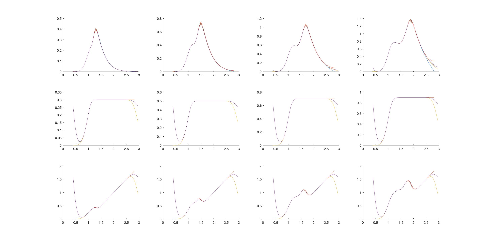

# Master Project in Financial Mathematics, EPFL
## Pricing TARN Using Numerical Methods
The goal of this project is to find some efficient numerical methods in order to price Target Accrual Redemption Notes (TARN).
For the moment I have implemented the Monte Carlo (MC), Finite Difference (FD) Gauss-Hermite Quadrature with Cubic interpolation (GHQC) methods on a Black-Scholes model with constant paramters.

However there is a problem with a special case, called No Gain Knock-Out type, for the FD and GHQC methods. The problem seems to be in the interpolation of a discontinous function.

The next step is to find other methods, more efficient than these ones if possible and extend them to more complex models as Local Volatility or Stochastic Volatility models.

## Results
Results under BS model: 
(MC = 2e5 simulations ; FD = 500 x 500 x 100; GHQC = 500 x 100; QUAD,CONV = 1024 x 100)

      KO_Type      Target      MC         FD        GHQC       QUAD       CONV  
    ___________    ______    _______    _______    _______    _______    _______

    'No Gain'      0.3       0.19553    0.20580    0.20564    0.20571    0.20572
    'No Gain'      0.5       0.32856    0.33747    0.33760    0.33752    0.33753
    'No Gain'      0.7       0.45098    0.45959    0.45965    0.45963    0.45960
    'No Gain'      0.9       0.56267    0.57236    0.57218    0.57216    0.57223
    
    'Part Gain'    0.3       0.24473    0.24454    0.24450    0.24454    0.24458
    'Part Gain'    0.5       0.38194    0.38181    0.38176    0.38180    0.38187
    'Part Gain'    0.7       0.50609    0.50610    0.50604    0.50609    0.50619
    'Part Gain'    0.9       0.62088    0.61998    0.61990    0.61997    0.62010
    
    'Full Gain'    0.3       0.29801    0.29777    0.29760    0.29765    0.29795
    'Full Gain'    0.5       0.43822    0.43862    0.43856    0.43861    0.43891
    'Full Gain'    0.7       0.56411    0.56441    0.56443    0.56437    0.56464
    'Full Gain'    0.9       0.67758    0.67895    0.67869    0.67873    0.67909
    ----------------------------------------------------------------------------
            CPU Time (sec) :  12.13       3.90      14.26       3.10       2.78
          
Results under BS model: 
(MC = 1e6 simulations ; FD = 1000 x 1000 x 200; GHQC = 1000 x 200; QUAD,CONV = 4096 x 200)

      KO_Type      Target      MC         FD        GHQC       QUAD       CONV  
    ___________    ______    _______    _______    _______    _______    _______

    'No Gain'      0.3       0.19556    0.20579    0.20539    0.20582    0.20582
    'No Gain'      0.5       0.32866    0.33755    0.33746    0.33750    0.33750
    'No Gain'      0.7       0.45018    0.45960    0.45975    0.45962    0.45963
    'No Gain'      0.9       0.56325    0.57234    0.57240    0.57232    0.57231
    
    'Part Gain'    0.3       0.24450    0.24453    0.24452    0.24454    0.24458
    'Part Gain'    0.5       0.38117    0.38179    0.38178    0.38180    0.38188
    'Part Gain'    0.7       0.50614    0.50608    0.50606    0.50609    0.50620
    'Part Gain'    0.9       0.61945    0.61995    0.61993    0.61996    0.62010
    
    'Full Gain'    0.3       0.29772    0.29771    0.29744    0.29772    0.29802
    'Full Gain'    0.5       0.43875    0.43864    0.43859    0.43862    0.43892
    'Full Gain'    0.7       0.56455    0.56439    0.56451    0.56442    0.56474
    'Full Gain'    0.9       0.67921    0.67896    0.67897    0.67894    0.67924
    ----------------------------------------------------------------------------
            CPU Time (sec) :  61.75      22.11      55.82      34.77      12.55

## Plots

Valentin Bandelier
